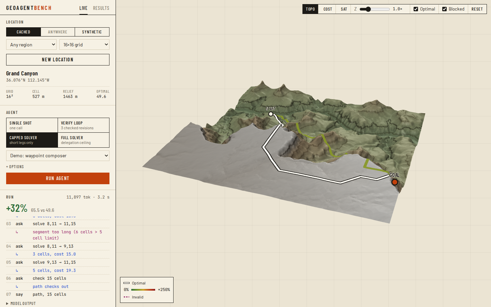

# GeoAgentBench

A benchmark for how well LLM agents plan routes over real terrain, and how much a classical solver in the loop recovers.

Each task is a cost grid built from a real elevation model (or synthetic fractal terrain) with a start, a goal and impassable cells. The agent returns a cell-by-cell route. A Dijkstra oracle computes the true optimum, and every answer is scored by validity, **regret** (how much longer than optimal) and a failure category.

It ships with a 3D viewer. Pick a random location anywhere in the world and watch an agent search for a route in real time, with the optimal route drawn beside it.



## What it varies

| Axis | Options |
|---|---|
| Agent topology | `single_shot`, `plan_critique_revise` (LLM critiques itself), `plan_verify_revise` (code verifier feeds back real issues), `tool_loop` (OpenAI tool calling) |
| Tool access | `none`, `calculator` (path checker), `restricted_solver` (solver only answers short legs), `full_solver` |
| Prompt | cost grid as JSON, prose description, or both |
| Terrain | Yosemite, Grand Canyon, Matterhorn, random places via OpenTopography, synthetic |

Every `(task, config)` pair runs `k` times and is reported as median regret with IQR. API failures are retried and never scored as agent failures. Task and config IDs are deterministic hashes, so every result traces back to exactly what produced it.

## Results

16×16 grids, structured prompt, 15 runs per config.

| Config | Model | Valid | Median regret |
|---|---|---|---|
| Single shot | gpt-4o-mini | 27% | 0.58 |
| Self-critique | gpt-4o-mini | 13% | 0.82 |
| Verify loop, 1 round | gpt-4o-mini | 40% | 0.65 |
| Verify loop, 3 rounds | gpt-4o-mini | 67% | 0.91 |
| Tool loop + path checker | gpt-4o | 100%* | 0.62 |
| Tool loop + solver capped at 5 cells | gpt-4o | 90%* | 0.30 |
| Tool loop + full solver | gpt-4o | 100% | 0.00 |

\*over runs that completed; some were rate-limited.

- **Self-critique hurts.** The model invents issues in its own plan and "fixes" them while stepping onto real obstacles.
- **Deterministic verification helps.** The same loop shape with a code verifier lifts validity from 27% to 67%.
- **A full solver measures delegation, not reasoning.** gpt-4o calls the solver once and returns its answer.
- **Capping solver legs forces real composition.** Sweeping the cap from 3 to 20 cells gives a monotonic curve for gpt-4o (regret 0.33 → 0). gpt-4o-mini's curve dips at cap 8, where its valid runs beat gpt-4o's (0.05 vs 0.13 regret, small n).

Raw runs and traces are in `results-v2/` and `results-sweep/`.

## Quickstart

Requires Python 3.11+, [uv](https://docs.astral.sh/uv/), and Node 20.19+ for the viewer.

```bash
git clone https://github.com/<you>/geoagentbench.git
cd geoagentbench
uv sync --extra geo --extra api --extra dev
cp .env.example .env        # add OPENAI_API_KEY, optionally OPENTOPO_API_KEY

uv run pytest
uv run geoab preflight      # 36 mock runs covering every failure category, no API calls
```

## Running experiments

```bash
# estimate cost first
uv run geoab run --seeds 0-4 --k 3 --model gpt-4o --topology tool_loop --dry-run

# baseline
uv run geoab run --seeds 0-4 --k 3 --model gpt-4o-mini

# verify loop
uv run geoab run --seeds 0-4 --k 3 --model gpt-4o-mini --topology plan_verify_revise --max-revise-rounds 3

# tool loop with a capped solver, on real terrain
uv run geoab run --seeds 0-4 --k 3 --model gpt-4o --topology tool_loop \
  --tool-access restricted_solver --max-segment-cells 8 --region yosemite

# free end-to-end check
uv run geoab run --seeds 0-4 --k 3 --mock --mock-mode oracle

# cap sweep
uv run python scripts/sweep_segments.py --caps 3,5,8,12,20 --model gpt-4o-mini
```

Inspect results:

```bash
uv run geoab list runs --results-dir results-v2 --limit 20
uv run geoab show <run_id prefix> --results-dir results-v2
uv run geoab prompt --seed 0 --condition structured_only   # the exact prompt, no API call
```

## Viewer

```bash
uv run uvicorn geoagentbench.api.app:app --port 8000   # terminal 1
cd web && npm install && npm run dev                     # terminal 2, http://localhost:5173
```

**Live** runs agents at inference:

1. Choose a location: a random window in a cached region, **Anywhere** (a random mountain range, fetched on demand; needs `OPENTOPO_API_KEY`), or synthetic terrain.
2. Choose an agent: a preset or any topology / tool access / leg cap. OpenAI runs cost tokens; the demo providers are free.
3. Run it. Each model step, solver leg and draft path streams onto the map as it happens, and the finished run is scored against the optimal route.

**Results** browses a results database. Set `GEOAB_RESULTS_DIR=results-v2` before starting the API to view the recorded experiments.

Map views: **Topo** (elevation with contours), **Cost** (the exact grid the agent saw), **Sat** (satellite imagery, needs internet).

## Configuration

| Variable | Default | Used for |
|---|---|---|
| `OPENAI_API_KEY` | | real agent runs |
| `OPENTOPO_API_KEY` | | `fetch_data.py` and Live → Anywhere |
| `GEOAB_DATA_DIR` | `data` | DEMs and terrain images |
| `GEOAB_RESULTS_DIR` | `results` | benchmark results the API serves |
| `GEOAB_LIVE_DIR` | `results-live` | tasks and runs created in Live mode |

## Data

Yosemite, Grand Canyon and Matterhorn DEMs are included. To fetch them again, or to add a region in `src/geoagentbench/regions.py`:

```bash
uv run python scripts/fetch_data.py --region all
uv run python scripts/encode_terrain.py --region all
```

Elevation data: Copernicus DEM GLO-30, © DLR e.V. 2010–2014 and © Airbus Defence and Space GmbH 2014–2018, provided under COPERNICUS by the European Union and ESA; all rights reserved. Fetched via [OpenTopography](https://opentopography.org/). Water features © OpenStreetMap contributors.

## Layout

```
src/geoagentbench/
  tasks/      task generators (synthetic, DEM, windowed DEM)
  solvers/    Dijkstra oracle
  scorers/    validity, regret, failure taxonomy
  runner/     agents, tools, providers, executor, SQLite store
  api/        FastAPI backend and live-run streaming
  cli.py      geoab command
web/          React + deck.gl viewer
scripts/      data fetching, terrain encoding, sweeps, demo render
tests/
```


